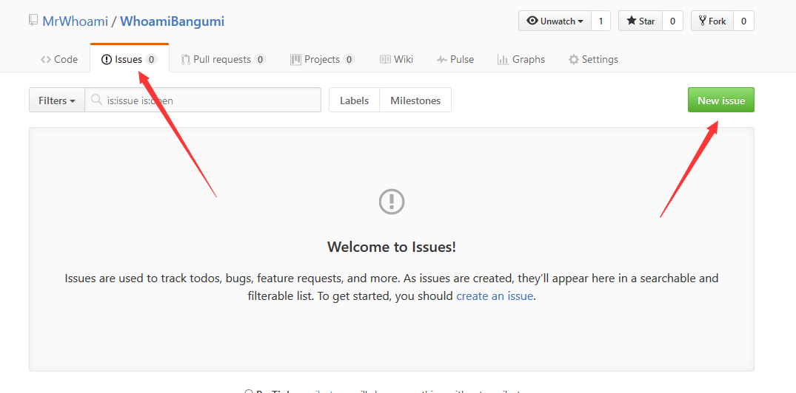

# Whoami 的中国视频网站动画番剧列表（停止维护）

## 概要
中国国内的版权意识也在日益增强中，动画番组也是如此，各个平台只购买了部分番组的版权。有版权意识是件好事，但是找番却变成了一件累人的事情，因此，该工具用于列举中国国内的各个视频网站当期的动画番组版权购买情况。

----------------------------------------

**[该项目已不再维护](https://www.mrwhoami.com/archives/72)**

--------------------------------------

## 目前支持网站
* AcFun
* bilibili
* 爱奇艺
* 优酷土豆
* PPTV

## 使用方法

### 依赖
* Git （如果你想用 git clone 命令下载代码）
* Python 2.7
* Python 2.7 库
    * BeautifulSoup 4

### 命令行版本
使用前请先确认安装了 Python 2.7 版本，并安装了相应的库。  
Python 2.7 版本请自行去官网下载，官网网址请百度。  
安装必要的 Python 库建议使用 pip，在 shell 下运行下面的命令：

```bash
pip install beautifulsoup4
```

Linux 系统下使用任意 shell 运行下面的命令。  
Windows 系统下推荐使用 Git Shell 运行下面的命令。

```bash
git clone https://github.com/MrWhoami/whoamibangumi.git
python cli.py
```

如果想要输出到文件，请使用系统自带的重定向，同样是 shell 命令，文件名并不一定是 `OUTPUT.txt`：

```
python main.py > OUTPUT.txt
```

### 网页版本
网页版本的可以直接在线访问在线 Demo：<http://bangumi.applinzi.com>

如果自己搭建，分为完整的服务器和 SAE 部署两种情况。

SAE 部署情况下，直接将 master 分支的代码 clone 下来，视情况修改 config.yaml 中的应用名称信息后，按照 SAE 的代码管理方式上传即可。

自己搭建的话，将 index.wsgi 重命名为 index.py，然后运行 index.py 即可，当然，也要先使用 pip 获取 web.py 的库。

## Bug 与意见提交
请使用 Github 的 Issue 系统：


